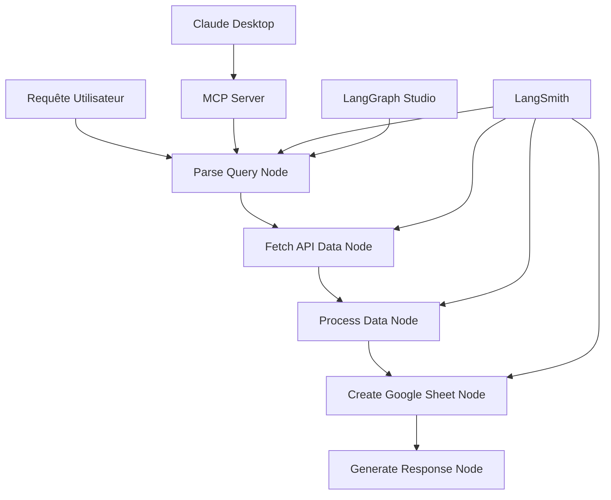

# 🚀 API to Sheets Agent v2

[LangGraph](https://img.shields.io/badge/LangGraph-%F0%9F%94%97_Orchestration-blue)

[LangSmith](https://img.shields.io/badge/LangSmith-%F0%9F%93%8A_Observability-green)

[MCP](https://img.shields.io/badge/MCP-%F0%9F%94%8C_Protocol-purple)

[Python](https://img.shields.io/badge/Python-3.9+-yellow)

[License](https://img.shields.io/badge/License-MIT-red)

Un agent intelligent qui récupère des données depuis des APIs et les exporte automatiquement vers Google Sheets. Construit avec **LangGraph**, **LangSmith** et le **protocole MCP** pour une intégration native avec Claude Desktop.

## 🎯 Fonctionnalités

- **🤖 Agent LangGraph Intelligent** : Parse les requêtes en langage naturel
- **📊 Export Google Sheets** : Création automatique de feuilles organisées
- **🔌 Protocole MCP** : Intégration native avec Claude Desktop
- **🎨 LangGraph Studio** : Interface visuelle pour debugging
- **📈 LangSmith Observability** : Tracking tokens, coûts et performance
- **🌐 APIs Flexibles** : Support JSONPlaceholder et APIs personnalisées
- **🔧 Configuration Avancée** : Variables d'environnement et paramétrage fin

## 🏗️ Architecture



## 🚀 Installation Rapide

### 1. Cloner le Projet

```bash
git clone https://github.com/votre-username/api-to-sheets-agent-v2.git
cd api-to-sheets-agent-v2
```

### 2. Installer les Dépendances

```bash
# Créer un environnement virtuel
python -m venv venv
source venv/bin/activate  # Sur Windows: venv\Scripts\activate

# Installer les dépendances
pip install -r requirements.txt

# Ou avec uv (plus rapide)
curl -LsSf https://astral.sh/uv/install.sh | sh
uv pip install -r requirements.txt
```

### 3. Configuration Environnement

```bash
# Copier le template d'environnement
cp .env.example .env

# Éditer .env avec vos clés API
nano .env
```

**Variables obligatoires dans `.env` :**

```
# OpenAI (OBLIGATOIRE)
OPENAI_API_KEY=sk-proj-votre_clé_openai_ici

# Google Sheets (OBLIGATOIRE)
GOOGLE_CREDENTIALS_PATH=./google-credentials.json
GOOGLE_PERSONAL_EMAIL=votre.email@gmail.com

# LangSmith (OPTIONNEL)
LANGSMITH_API_KEY=votre_clé_langsmith
LANGCHAIN_PROJECT=api-to-sheets-agent
```

### 4. Configuration Google Sheets

1. **Créer un projet Google Cloud** : [Console Google Cloud](https://console.cloud.google.com/)
2. **Activer les APIs** : Google Sheets API + Google Drive API
3. **Créer un compte de service** : Télécharger `google-credentials.json`
4. **Placer le fichier** : `google-credentials.json` à la racine du projet

## 🎮 Utilisation

### Mode LangGraph Studio (Recommandé)

```bash
# Démarrer LangGraph Studio
langgraph dev

# Ouvrir http://localhost:8123 dans votre navigateur
# Interface visuelle pour tester et débugger l'agent
```

### Mode Serveur MCP + Claude Desktop

1. **Configurer Claude Desktop** :

```bash
python scripts/setup_claude.py
```

1. **Redémarrer Claude Desktop**
2. **Tester la connexion** :
    - Dans Claude Desktop : `hello`
    - Réponse attendue : Status complet du serveur MCP
3. **Utiliser l'agent** :
    
    ```
    run_agent query="récupère 5 posts avec title et id"
    get_posts limit=3
    get_users limit=5
    ```
    

### Mode Python Direct

```python
from src.agent.graph import run_agent_with_tracing

# Exécuter l'agent
result = run_agent_with_tracing("récupère 10 posts avec title et body")

print(f"Sheet créé : {result['sheets_url']}")
print(f"Données traitées : {len(result['processed_data'])} items")
```

## 📊 Exemples de Requêtes

```bash
# Dans LangGraph Studio ou Claude Desktop :

"récupère 5 posts avec title et id"
"obtiens 10 utilisateurs et sauvegarde dans une feuille"
"prends 3 posts avec seulement le contenu"
"récupère 15 posts et exporte tout"
```

## 🔧 Configuration Avancée

### Variables d'Environnement Complètes

```
# === API CONFIGURATION ===
DEFAULT_API_URL=https://jsonplaceholder.typicode.com/posts
API_TIMEOUT=30
MAX_RETRIES=3

# === LIMITES MÉTIER ===
DEFAULT_LIMIT=10
MAX_LIMIT=100
MIN_LIMIT=1

# === GOOGLE SHEETS ===
SHEETS_FOLDER_NAME=API_Data_Exports
SHEETS_SHARE_PUBLICLY=false
SHEETS_DEFAULT_TITLE_PREFIX=API_Data

# === MODÈLE OPENAI ===
OPENAI_MODEL=gpt-4o-mini
OPENAI_TEMPERATURE=0.1

# === DEBUG ===
DEBUG=true
LOG_LEVEL=INFO
```

### Personnaliser les APIs

Modifiez `src/agent/graph.py` pour ajouter de nouvelles APIs :

```python
# Ajouter votre API personnalisée
CUSTOM_API_URL = "https://votre-api.com/data"

# Dans fetch_api_data(), ajouter la logique de votre API
```

## 🛠️ Développement

### Structure du Projet

```
api-to-sheets-agent-v2/
├── src/agent/
│   ├── graph.py              # Agent LangGraph principal
│   └── mcp/
│       ├── server.py         # Serveur MCP
│       ├── tools/            # Outils MCP
│       └── resources/        # Ressources MCP
├── scripts/
│   ├── setup_claude.py       # Configuration Claude Desktop
│   └── fix_imports.py        # Correction imports Python
├── .env.example              # Template configuration
├── langgraph.json           # Configuration LangGraph
├── requirements.txt         # Dépendances Python
└── pyproject.toml          # Configuration projet
```

### Linting et Formatage

```bash
# Ruff (linting + formatage)
ruff check .
ruff format .

# Type checking
mypy src/
```

## 📈 Observabilité avec LangSmith

L'agent intègre automatiquement **LangSmith** pour :

- **💰 Tracking des coûts** : Tokens et prix OpenAI en temps réel
- **⏱️ Performance** : Latence de chaque étape
- **🔍 Debugging** : Traces détaillées des exécutions
- **📊 Analytics** : Statistiques d'utilisation

**Accéder aux métriques** : https://smith.langchain.com/projects/api-to-sheets-agent

## 🔌 Protocole MCP

Le **Model Context Protocol (MCP)** permet une intégration native avec Claude Desktop :

### Outils MCP Disponibles

- `hello` - Test de connexion avec status complet
- `get_posts limit=X` - Récupérer des posts
- `get_users limit=X` - Récupérer des utilisateurs
- `run_agent query="..."` - Exécuter l'agent complet
- `create_sheet title="..."` - Créer une feuille simple

### Architecture MCP

```python
# Serveur MCP autonome
python src/agent/mcp/server.py

# Intégration dans Claude Desktop via claude_desktop_config.json
{
  "mcpServers": {
    "api-sheets-agent": {
      "command": "python",
      "args": ["src/agent/mcp/server.py"],
      "env": {
        "OPENAI_API_KEY": "...",
        "GOOGLE_CREDENTIALS_PATH": "..."
      }
    }
  }
}
```

## 🚨 Résolution de Problèmes

### Erreurs Communes

**❌ OpenAI API Error**

```bash
# Vérifier la clé API
echo $OPENAI_API_KEY
# Tester la connexion
python -c "from openai import OpenAI; print(OpenAI().models.list())"
```

**❌ Google Sheets Error**

```bash
# Vérifier les credentials
python -c "import gspread; print('Google Sheets OK')"
# Tester les permissions
python cleanup_sheets.py  # Script de diagnostic
```

**❌ MCP Connection Error**

```bash
# Diagnostic serveur MCP
python src/agent/mcp/server.py
# Vérifier la configuration Claude Desktop
python scripts/setup_claude.py
```

### Scripts de Diagnostic

```bash
# Nettoyage Google Drive
python cleanup_drive.py

# Correction structure projet
python scripts/fix_imports.py

# Test complet de l'agent
python src/agent/graph.py
```

## 📝 Changelog

### v2.0.0

- ✨ Intégration protocole MCP
- 🎨 Support LangGraph Studio
- 📊 Observabilité LangSmith complète
- 🔧 Configuration environnement améliorée
- 📁 Organisation automatique des Google Sheets

### v1.0.0

- 🚀 Version initiale avec LangGraph
- 📋 Export Google Sheets de base
- 🌐 Support JSONPlaceholder API

## 📄 License

Distribué sous la licence MIT. Voir `LICENSE` pour plus d'informations.

## 🙏 Remerciements

- [LangGraph](https://github.com/langchain-ai/langgraph) - Framework d'orchestration d'agents
- [LangSmith](https://smith.langchain.com/) - Plateforme d'observabilité LLM
- [Model Context Protocol](https://modelcontextprotocol.io/) - Standard d'intégration Claude
- [Google Sheets API](https://developers.google.com/sheets) - API Google Sheets
- [JSONPlaceholder](https://jsonplaceholder.typicode.com/) - API de test

---

**💡 Astuce** : Commencez par LangGraph Studio pour comprendre le flow, puis intégrez MCP pour une utilisation quotidienne dans Claude Desktop !

**🔗 Liens Utiles** :

- [Documentation LangGraph](https://langchain-ai.github.io/langgraph/)
- [Guide LangSmith](https://docs.smith.langchain.com/)
- [Spécification MCP](https://spec.modelcontextprotocol.io/)
